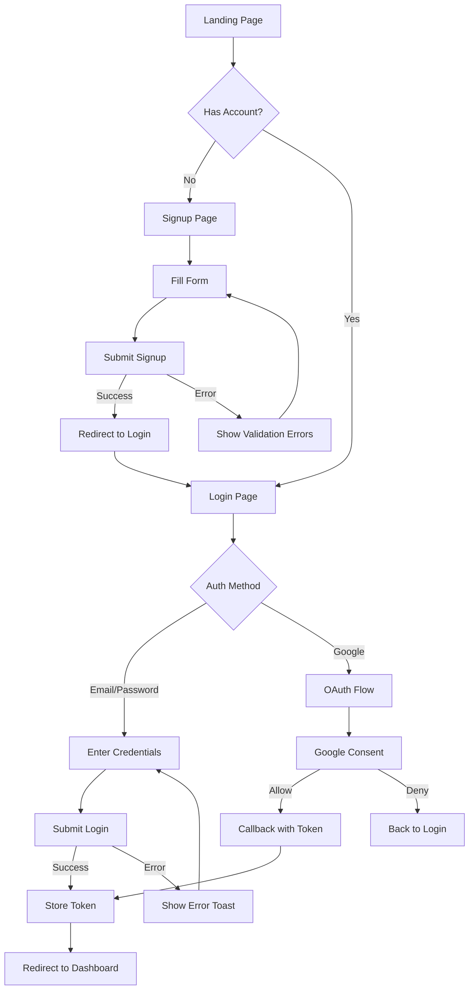
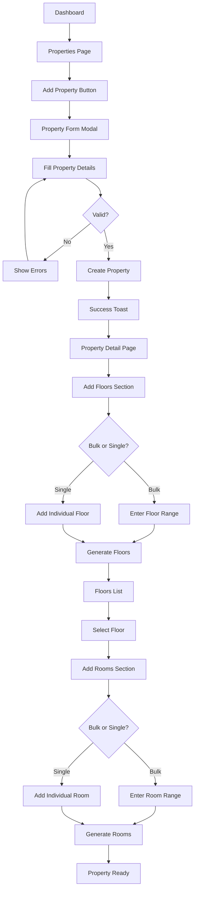
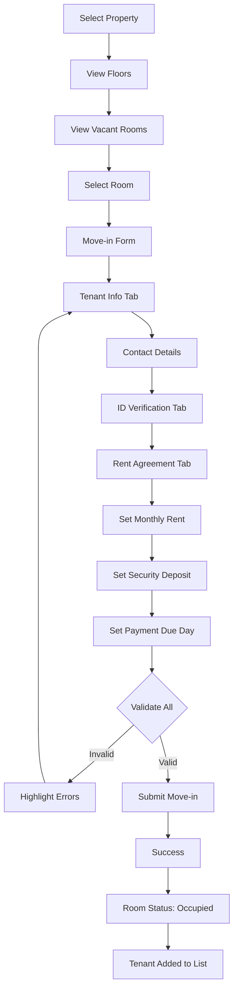
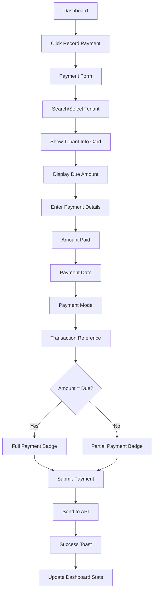
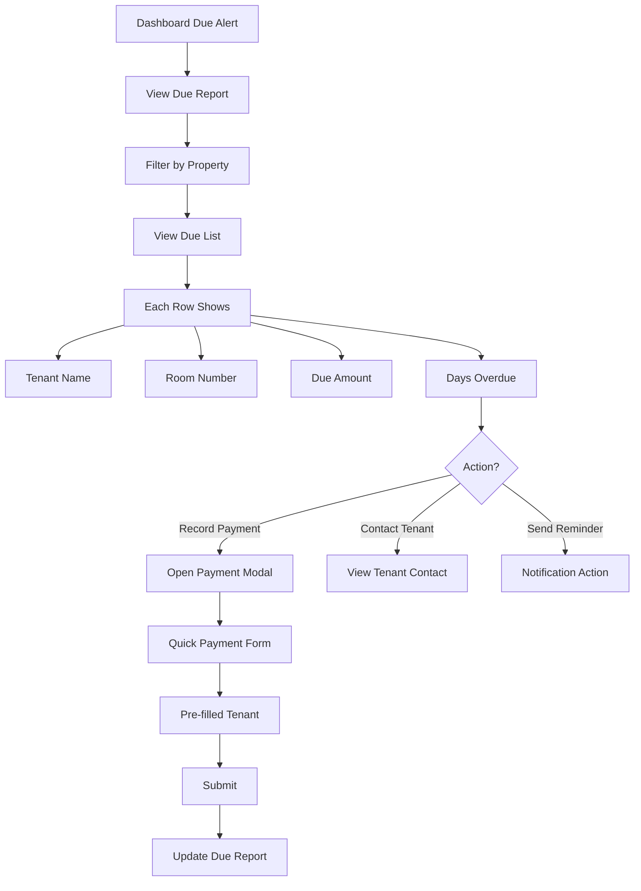

# Tenant Management System - Frontend Plan

A comprehensive frontend architecture with modern UI/UX design and structured user flows.

---

## 📋 Table of Contents
1. [Design System](#design-system)
2. [Application Architecture](#application-architecture)
3. [User Flows](#user-flows)
4. [Page Specifications](#page-specifications)
5. [Component Library](#component-library)
6. [State Management](#state-management)
7. [API Integration](#api-integration)

---

## 🎨 Design System

### Color Palette

| Token | Light Mode | Dark Mode | Usage |
|-------|------------|-----------|-------|
| `--primary` | `#6366F1` | `#818CF8` | Primary actions, links |
| `--primary-hover` | `#4F46E5` | `#6366F1` | Hover states |
| `--success` | `#10B981` | `#34D399` | Positive status, payments |
| `--warning` | `#F59E0B` | `#FBBF24` | Pending, due soon |
| `--danger` | `#EF4444` | `#F87171` | Errors, overdue |
| `--surface` | `#FFFFFF` | `#1E1E2E` | Cards, modals |
| `--background` | `#F8FAFC` | `#11111B` | Page background |
| `--text-primary` | `#1E293B` | `#CDD6F4` | Headings, body |
| `--text-secondary` | `#64748B` | `#A6ADC8` | Labels, hints |
| `--border` | `#E2E8F0` | `#313244` | Dividers, borders |

### Typography

```
Font Family: 'Inter', system-ui, sans-serif

Headings:
  h1: 2rem (32px) / 700 weight / -0.02em letter-spacing
  h2: 1.5rem (24px) / 600 weight
  h3: 1.25rem (20px) / 600 weight
  h4: 1rem (16px) / 600 weight

Body:
  Regular: 0.875rem (14px) / 400 weight / 1.5 line-height
  Small: 0.75rem (12px) / 400 weight
```

### Spacing Scale
```
--space-1: 0.25rem (4px)
--space-2: 0.5rem (8px)
--space-3: 0.75rem (12px)
--space-4: 1rem (16px)
--space-5: 1.5rem (24px)
--space-6: 2rem (32px)
--space-8: 3rem (48px)
```

### Border Radius
```
--radius-sm: 4px   (buttons, inputs)
--radius-md: 8px   (cards)
--radius-lg: 12px  (modals)
--radius-xl: 16px  (large containers)
--radius-full: 9999px (avatars, badges)
```

### Shadows
```
--shadow-sm: 0 1px 2px rgba(0,0,0,0.05)
--shadow-md: 0 4px 6px -1px rgba(0,0,0,0.1)
--shadow-lg: 0 10px 15px -3px rgba(0,0,0,0.1)
--shadow-glow: 0 0 20px rgba(99,102,241,0.15)
```

---

## 🏗️ Application Architecture

### Directory Structure

```
src/
├── assets/                 # Static assets (images, icons)
├── components/
│   ├── common/            # Reusable UI components
│   │   ├── Button/
│   │   ├── Card/
│   │   ├── Input/
│   │   ├── Modal/
│   │   ├── Table/
│   │   ├── Badge/
│   │   ├── Avatar/
│   │   ├── Dropdown/
│   │   ├── Toast/
│   │   └── Skeleton/
│   ├── layout/
│   │   ├── Sidebar/
│   │   ├── Header/
│   │   ├── PageContainer/
│   │   └── Breadcrumb/
│   └── features/          # Feature-specific components
│       ├── dashboard/
│       ├── properties/
│       ├── tenants/
│       ├── payments/
│       └── users/
├── pages/
│   ├── auth/
│   │   ├── Login.jsx
│   │   ├── Signup.jsx
│   │   └── OAuthRedirect.jsx
│   ├── Dashboard.jsx
│   ├── Properties/
│   │   ├── PropertyList.jsx
│   │   ├── PropertyDetail.jsx
│   │   └── PropertyForm.jsx
│   ├── Tenants/
│   │   ├── TenantList.jsx
│   │   ├── TenantDetail.jsx
│   │   └── TenantForm.jsx
│   ├── Payments/
│   │   ├── PaymentList.jsx
│   │   ├── RecordPayment.jsx
│   │   └── DueReport.jsx
│   ├── Users/
│   │   ├── Profile.jsx
│   │   ├── UserManagement.jsx
│   │   └── AccessControl.jsx
│   └── NotFound.jsx
├── hooks/                 # Custom React hooks
│   ├── useAuth.js
│   ├── useApi.js
│   ├── useToast.js
│   └── useDebounce.js
├── services/              # API service layer
│   ├── api.js
│   ├── authService.js
│   ├── propertyService.js
│   ├── tenantService.js
│   ├── rentService.js
│   └── dashboardService.js
├── context/               # React Context providers
│   ├── AuthContext.jsx
│   ├── ThemeContext.jsx
│   └── ToastContext.jsx
├── utils/
│   ├── constants.js
│   ├── formatters.js
│   └── validators.js
├── styles/
│   ├── variables.css
│   ├── global.css
│   └── animations.css
├── App.jsx
├── main.jsx
└── router.jsx
```

### Routing Structure

| Route | Page | Access |
|-------|------|--------|
| `/login` | Login | Public |
| `/signup` | Signup | Public |
| `/oauth2/redirect` | OAuth Handler | Public |
| `/` | Dashboard | Protected |
| `/properties` | Property List | Protected |
| `/properties/new` | Create Property | Protected |
| `/properties/:id` | Property Detail | Protected |
| `/properties/:id/edit` | Edit Property | Protected |
| `/tenants` | Tenant List | Protected |
| `/tenants/new` | Add Tenant (Move-in) | Protected |
| `/tenants/:id` | Tenant Detail | Protected |
| `/tenants/:id/edit` | Edit Tenant | Protected |
| `/payments` | Payment List | Protected |
| `/payments/record` | Record Payment | Protected |
| `/payments/due` | Due Report | Protected |
| `/profile` | User Profile | Protected |
| `/users` | User Management | Protected (Owner) |
| `/users/access` | Access Control | Protected (Owner) |

---

## 🔄 User Flows

### Flow 1: Authentication Journey



### Flow 2: Property Setup Flow



### Flow 3: Tenant Move-In Flow



### Flow 4: Rent Payment Flow



### Flow 5: Due Report & Follow-up Flow



---

## 📄 Page Specifications

### 1. Login Page

**Layout**: Centered card layout with illustration

**Components**:
- Logo + App name
- Email input field
- Password input field with visibility toggle
- "Remember me" checkbox
- Login button (primary)
- "Forgot password?" link
- Divider with "OR"
- Google Sign-in button (outlined)
- Sign up link

**Visual Design**:
```
┌──────────────────────────────────────────────────────────────────┐
│                                                                  │
│     🏠                                                          │
│                      ┌─────────────────────────┐                │
│     [Illustration]   │   Tenant Management     │                │
│     of property      │                         │                │
│     management       │   📧 Email              │                │
│                      │   └─────────────────────┤                │
│                      │   🔒 Password       👁️  │                │
│                      │   └─────────────────────┤                │
│                      │                         │                │
│                      │   ☐ Remember me         │                │
│                      │                         │                │
│                      │   [    Login     ]      │                │
│                      │                         │                │
│                      │   ─────── or ───────    │                │
│                      │                         │                │
│                      │   [G] Continue with Google │              │
│                      │                         │                │
│                      │   Don't have account?   │                │
│                      │   Sign up               │                │
│                      └─────────────────────────┘                │
│                                                                  │
└──────────────────────────────────────────────────────────────────┘
```

**Interactions**:
- Input validation on blur
- Loading spinner on submit
- Error shake animation on failed login
- Smooth transition to dashboard on success

---

### 2. Dashboard Page

**Layout**: Stats grid + Recent activity + Quick actions

**Sections**:

#### A. Stats Cards Row
```
┌─────────────┐ ┌─────────────┐ ┌─────────────┐ ┌─────────────┐
│ 📊 Total    │ │ 🏠 Total    │ │ 🟢 Occupied │ │ ⭕ Vacant   │
│ Properties  │ │ Rooms       │ │ Rooms       │ │ Rooms       │
│             │ │             │ │             │ │             │
│    5        │ │    48       │ │    42       │ │    6        │
│   ↗ +2      │ │   ↗ +5      │ │   87.5%     │ │   12.5%     │
└─────────────┘ └─────────────┘ └─────────────┘ └─────────────┘
```

#### B. Revenue Stats Row
```
┌───────────────────────────────┐ ┌───────────────────────────────┐
│ 💰 Rent Expected (Jan 2026)   │ │ ✅ Rent Collected             │
│                               │ │                               │
│     ₹4,85,000                 │ │     ₹3,92,000                 │
│                               │ │                               │
│  ████████████░░░░  80.8%      │ │  Progress indicator           │
└───────────────────────────────┘ └───────────────────────────────┘
```

#### C. Charts Row
```
┌─────────────────────────────────────┐  ┌──────────────────────────┐
│  📈 Rent Collection Trends          │  │  🥧 Occupancy by Property│
│                                     │  │                          │
│  ▲                                  │  │    ┌───┐                 │
│  │    ╭─────╮                       │  │   ╱  A  ╲                │
│  │   ╱       ╲    ╭────             │  │  │   B   │               │
│  │  ╱         ╲──╱                  │  │   ╲  C  ╱                │
│  │ ╱                                │  │    └───┘                 │
│  └──────────────────────────▶       │  │                          │
│    Aug Sep Oct Nov Dec Jan          │  │  Property A: 95%         │
│                                     │  │  Property B: 88%         │
│                                     │  │  Property C: 75%         │
└─────────────────────────────────────┘  └──────────────────────────┘
```

#### D. Quick Actions + Alerts
```
┌──────────────────────────────┐  ┌────────────────────────────────┐
│  ⚡ Quick Actions            │  │  🔔 Pending Actions            │
│                              │  │                                │
│  [+ Add Tenant]              │  │  ⚠️ 5 tenants have dues        │
│  [+ Record Payment]          │  │     ₹93,000 pending            │
│  [+ Add Property]            │  │     [View Report →]            │
│                              │  │                                │
│                              │  │  📅 3 agreements expiring      │
│                              │  │     This month                 │
│                              │  │     [Review →]                 │
└──────────────────────────────┘  └────────────────────────────────┘
```

#### E. Recent Activity
```
┌─────────────────────────────────────────────────────────────────┐
│  📋 Recent Activity                                    [See All]│
├─────────────────────────────────────────────────────────────────┤
│  💳 Payment received from Rahul Sharma    ₹12,000    2 min ago │
│  🏠 New tenant added: Priya Singh         Room 204   1 hr ago  │
│  📝 Agreement updated for Room 105                   3 hrs ago │
│  👋 Tenant moved out: Amit Kumar          Room 108   Yesterday │
└─────────────────────────────────────────────────────────────────┘
```

---

### 3. Property List Page

**Layout**: Filterable grid/list view with search

**Header Section**:
```
┌─────────────────────────────────────────────────────────────────┐
│  Properties                                    [ + Add Property ]│
├─────────────────────────────────────────────────────────────────┤
│  🔍 Search properties...              [Grid] [List]    [Filter] │
└─────────────────────────────────────────────────────────────────┘
```

**Property Cards (Grid View)**:
```
┌──────────────────────────────┐
│  ┌────────────────────────┐  │
│  │     Property Image     │  │
│  │                        │  │
│  └────────────────────────┘  │
│                              │
│  🏢 Sunrise Apartments       │
│  📍 MG Road, Bangalore       │
│                              │
│  ┌──────┐ ┌──────┐ ┌──────┐ │
│  │ 🏠 5 │ │🟢 42 │ │⭕ 6  │ │
│  │Floors│ │Occup.│ │Vacant│ │
│  └──────┘ └──────┘ └──────┘ │
│                              │
│  [View Details]   [Edit] [⋮]│
└──────────────────────────────┘
```

---

### 4. Property Detail Page

**Layout**: Hero + Tabs

**Hero Section**:
```
┌─────────────────────────────────────────────────────────────────┐
│  ← Back to Properties                                           │
│                                                                  │
│  🏢 Sunrise Apartments                    [Edit] [Delete] [⋮]   │
│  📍 123 MG Road, Indiranagar, Bangalore - 560038                │
│                                                                  │
│  ┌──────────┐ ┌──────────┐ ┌──────────┐ ┌──────────┐           │
│  │ 5 Floors │ │ 48 Rooms │ │ 42 Occup │ │ ₹4.2L/mo │           │
│  └──────────┘ └──────────┘ └──────────┘ └──────────┘           │
└─────────────────────────────────────────────────────────────────┘
```

**Tabs**:
```
[ Overview ] [ Floors & Rooms ] [ Tenants ] [ Payments ] [ Settings ]
```

**Floors & Rooms Tab**:
```
┌─────────────────────────────────────────────────────────────────┐
│  Floors & Rooms                         [+ Add Floor] [+ Bulk]  │
├─────────────────────────────────────────────────────────────────┤
│                                                                  │
│  ▼ Floor 1 (Ground Floor)                          8/10 Rooms   │
│  ├─────────────────────────────────────────────────────────────┤│
│  │ ┌─────────┐ ┌─────────┐ ┌─────────┐ ┌─────────┐            ││
│  │ │  101    │ │  102    │ │  103    │ │  104    │  ...       ││
│  │ │ 🟢 Occ  │ │ 🟢 Occ  │ │ ⭕ Vac  │ │ 🟢 Occ  │            ││
│  │ │ R.Sharma│ │ P.Singh │ │ [Move in]│ │ A.Kumar │            ││
│  │ │ ₹12,000 │ │ ₹15,000 │ │         │ │ ₹11,000 │            ││
│  │ └─────────┘ └─────────┘ └─────────┘ └─────────┘            ││
│  └─────────────────────────────────────────────────────────────┤│
│                                                                  │
│  ▶ Floor 2 (First Floor)                           9/10 Rooms   │
│  ▶ Floor 3                                         8/10 Rooms   │
│                                                                  │
└─────────────────────────────────────────────────────────────────┘
```

---

### 5. Tenant List Page

**Layout**: Searchable table with filters

```
┌─────────────────────────────────────────────────────────────────┐
│  Tenants                                         [ + Add Tenant ]│
├─────────────────────────────────────────────────────────────────┤
│  🔍 Search by name or phone...                                  │
│                                                                  │
│  Property: [All ▾]  Status: [Active ▾]  Sort: [Name A-Z ▾]     │
└─────────────────────────────────────────────────────────────────┘

┌─────────────────────────────────────────────────────────────────┐
│  👤 Name           │ 📍 Room    │ 📞 Phone      │ 💰 Rent    │ ⚡│
├───────────────────┼────────────┼──────────────┼────────────┼───┤
│  Rahul Sharma     │ Sunrise-101│ 9876543210   │ ₹12,000    │ ✓ │
│  Priya Singh      │ Sunrise-204│ 9876543211   │ ₹15,000    │ ⚠️│
│  Amit Kumar       │ Lakeview-105│ 9876543212  │ ₹18,000    │ ✓ │
│  Sneha Patel      │ Sunrise-302│ 9876543213   │ ₹14,000    │ ❌│
└─────────────────────────────────────────────────────────────────┘
```

**Status Legend**:
- ✓ Green: Paid for current month
- ⚠️ Yellow: Due soon (within 5 days)
- ❌ Red: Overdue

---

### 6. Tenant Detail Page

**Layout**: Profile card + Activity tabs

```
┌─────────────────────────────────────────────────────────────────┐
│  ← Back to Tenants                                              │
│                                                                  │
│  ┌──────────────────────────────────────────────────────────┐   │
│  │  ┌──────┐   Rahul Sharma                    [Edit] [⋮]  │   │
│  │  │ 👤   │   📞 9876543210  📧 rahul@email.com            │   │
│  │  │      │   🏠 Room 101, Sunrise Apartments              │   │
│  │  └──────┘   📅 Move-in: Jan 15, 2025 (12 months)         │   │
│  └──────────────────────────────────────────────────────────┘   │
│                                                                  │
│  ┌────────────────┐  ┌────────────────┐  ┌────────────────┐     │
│  │ Monthly Rent   │  │ Security Dep   │  │ Payment Status │     │
│  │    ₹12,000     │  │    ₹24,000     │  │   ✅ Paid      │     │
│  └────────────────┘  └────────────────┘  └────────────────┘     │
└─────────────────────────────────────────────────────────────────┘

[ Payment History ] [ Agreement ] [ Documents ] [ Activity ]

┌─────────────────────────────────────────────────────────────────┐
│  Payment History                            [+ Record Payment]  │
├─────────────────────────────────────────────────────────────────┤
│  Month        │ Amount      │ Date        │ Mode    │ Status   │
├──────────────┼────────────┼────────────┼─────────┼──────────┤
│  Jan 2026    │ ₹12,000    │ Jan 05     │ UPI     │ ✅ Paid  │
│  Dec 2025    │ ₹12,000    │ Dec 03     │ Cash    │ ✅ Paid  │
│  Nov 2025    │ ₹12,000    │ Nov 10     │ UPI     │ ✅ Paid  │
└─────────────────────────────────────────────────────────────────┘
```

---

### 7. Record Payment Page

**Layout**: Form wizard with summary

```
┌─────────────────────────────────────────────────────────────────┐
│  Record Payment                                                  │
├─────────────────────────────────────────────────────────────────┤
│                                                                  │
│  ┌─────────────────────────────────────┐  ┌──────────────────┐  │
│  │                                     │  │ Payment Summary  │  │
│  │  Select Tenant                      │  │                  │  │
│  │  🔍 Search tenant...                │  │ Tenant: ---      │  │
│  │  └────────────────────────────────┤ │  │ Room: ---        │  │
│  │                                     │  │ Due: ---         │  │
│  │  ┌────────────────────────────────┐ │  │                  │  │
│  │  │ 👤 Rahul Sharma   Room 101    │ │  │ ─────────────────│  │
│  │  │    Due: ₹12,000               │ │  │                  │  │
│  │  │    [Select]                    │ │  │ Amount: ₹12,000  │  │
│  │  └────────────────────────────────┘ │  │ Mode: UPI        │  │
│  │                                     │  │ Date: Jan 14     │  │
│  │  Payment Details                    │  │                  │  │
│  │                                     │  │ ─────────────────│  │
│  │  Amount Paid                        │  │                  │  │
│  │  ┌───────────────────────────────┤ │  │ [Submit Payment] │  │
│  │  │ ₹ 12,000                      │ │  │                  │  │
│  │  └───────────────────────────────┘ │  └──────────────────┘  │
│  │                                     │                        │
│  │  Payment Date                       │                        │
│  │  ┌───────────────────────────────┤ │                        │
│  │  │ 📅 Jan 14, 2026               │ │                        │
│  │  └───────────────────────────────┘ │                        │
│  │                                     │                        │
│  │  Payment For Month                  │                        │
│  │  ┌───────────────────────────────┤ │                        │
│  │  │ January 2026              ▾  │ │                        │
│  │  └───────────────────────────────┘ │                        │
│  │                                     │                        │
│  │  Payment Mode                       │                        │
│  │  ○ Cash  ● UPI  ○ Card  ○ Bank     │                        │
│  │                                     │                        │
│  │  Transaction Reference (Optional)   │                        │
│  │  ┌───────────────────────────────┤ │                        │
│  │  │                               │ │                        │
│  │  └───────────────────────────────┘ │                        │
│  │                                     │                        │
│  └─────────────────────────────────────┘                        │
│                                                                  │
└─────────────────────────────────────────────────────────────────┘
```

---

### 8. Due Report Page

**Layout**: Filter + Summary + Table

```
┌─────────────────────────────────────────────────────────────────┐
│  Due Rent Report                                                 │
├─────────────────────────────────────────────────────────────────┤
│                                                                  │
│  Month: [January 2026 ▾]    Property: [All Properties ▾]       │
│                                                                  │
│  ┌────────────────┐  ┌────────────────┐  ┌────────────────┐     │
│  │ Total Due      │  │ Total Tenants  │  │ Overdue Count  │     │
│  │   ₹93,000      │  │      5         │  │      3         │     │
│  │                │  │                │  │   (15+ days)   │     │
│  └────────────────┘  └────────────────┘  └────────────────┘     │
│                                                                  │
└─────────────────────────────────────────────────────────────────┘

┌─────────────────────────────────────────────────────────────────┐
│  Tenant         │ Property/Room │ Due Amount │ Days   │ Actions │
├─────────────────┼──────────────┼────────────┼────────┼─────────┤
│ ❌ Sneha Patel  │ Sunrise-302  │ ₹28,000    │ 21 days│ [Pay]📞 │
│ ❌ Vijay Reddy  │ Lakeview-201 │ ₹35,000    │ 18 days│ [Pay]📞 │
│ ⚠️ Amit Shah   │ Sunrise-105  │ ₹15,000    │ 5 days │ [Pay]📞 │
│ ⚠️ Neha Gupta  │ Sunrise-401  │ ₹12,000    │ 3 days │ [Pay]📞 │
│ ⚠️ Raj Malhotra│ Lakeview-108 │ ₹3,000     │ 1 day  │ [Pay]📞 │
└─────────────────────────────────────────────────────────────────┘
```

---

### 9. User Profile Page

```
┌─────────────────────────────────────────────────────────────────┐
│  Profile Settings                                                │
├─────────────────────────────────────────────────────────────────┤
│                                                                  │
│  [ Personal Info ] [ Security ] [ Preferences ]                 │
│                                                                  │
│  ┌─────────────────────────────────────────────────────────────┐│
│  │                                                             ││
│  │   ┌──────────┐                                              ││
│  │   │   👤     │   Change Photo                               ││
│  │   │          │                                              ││
│  │   └──────────┘                                              ││
│  │                                                             ││
│  │   Full Name                                                 ││
│  │   ┌──────────────────────────────────────────────────────┐ ││
│  │   │ Dushyant Bhardwaj                                    │ ││
│  │   └──────────────────────────────────────────────────────┘ ││
│  │                                                             ││
│  │   Email ✓                                                   ││
│  │   ┌──────────────────────────────────────────────────────┐ ││
│  │   │ dushyant@example.com                      (Verified) │ ││
│  │   └──────────────────────────────────────────────────────┘ ││
│  │                                                             ││
│  │   Phone                                                     ││
│  │   ┌──────────────────────────────────────────────────────┐ ││
│  │   │ +91 9876543210                                       │ ││
│  │   └──────────────────────────────────────────────────────┘ ││
│  │                                                             ││
│  │   Account Type: OWNER                                       ││
│  │   Member Since: January 2025                                ││
│  │                                                             ││
│  │   [        Save Changes        ]                            ││
│  │                                                             ││
│  └─────────────────────────────────────────────────────────────┘│
│                                                                  │
└─────────────────────────────────────────────────────────────────┘
```

---

## 🧩 Component Library

### Common Components

| Component | Props | Description |
|-----------|-------|-------------|
| `Button` | variant, size, loading, disabled, icon | Primary CTAs and actions |
| `Input` | type, label, error, prefix, suffix | Form inputs with validation |
| `Card` | title, actions, padding, shadow | Content containers |
| `Modal` | open, onClose, title, size | Dialog overlays |
| `Table` | columns, data, sortable, pagination | Data tables |
| `Badge` | variant, size, dot | Status indicators |
| `Avatar` | src, name, size, online | User representations |
| `Dropdown` | items, trigger, placement | Action menus |
| `Toast` | type, message, duration | Notifications |
| `Skeleton` | variant, width, height | Loading placeholders |
| `Tabs` | items, active, onChange | Navigation tabs |
| `Tooltip` | content, placement | Hover information |
| `Pagination` | total, current, pageSize | Page navigation |
| `DatePicker` | value, onChange, range | Date selection |
| `Select` | options, value, searchable | Dropdown selection |
| `SearchInput` | value, onSearch, debounce | Search with debounce |
| `EmptyState` | icon, title, description, action | No data states |
| `StatCard` | title, value, change, icon | Dashboard statistics |
| `Chart` | type, data, options | Data visualization |

### Layout Components

| Component | Description |
|-----------|-------------|
| `AppLayout` | Main app shell with sidebar and header |
| `Sidebar` | Navigation sidebar with logo and menu |
| `Header` | Top header with search, notifications, profile |
| `PageContainer` | Page wrapper with consistent padding |
| `Breadcrumb` | Navigation breadcrumbs |
| `PageHeader` | Page title, description, and actions |

---

## 📦 State Management

### Context Structure

```javascript
// AuthContext - User authentication state
{
  user: { id, email, fullName, userType },
  token: string,
  isAuthenticated: boolean,
  loading: boolean,
  login: (credentials) => Promise,
  logout: () => void,
  updateProfile: (data) => Promise
}

// ThemeContext - Theme preferences
{
  theme: 'light' | 'dark',
  toggleTheme: () => void
}

// ToastContext - Notification system
{
  toasts: Array,
  showToast: (type, message) => void,
  removeToast: (id) => void
}
```

### API Response Caching Strategy

```
- Dashboard data: Cache for 2 minutes
- Property list: Cache until mutation
- Tenant list: Cache until mutation
- Payment history: Cache per tenant, invalidate on new payment
- User profile: Cache until update
```

---

## 🔌 API Integration

### Service Layer Structure

```javascript
// api.js - Base configuration
const api = axios.create({
  baseURL: 'http://localhost:8080',
  headers: { 'Content-Type': 'application/json' }
});

// Request interceptor - Add auth token
// Response interceptor - Handle errors, refresh token

// authService.js
export const authService = {
  signup: (data) => api.post('/api/auth/signup', data),
  login: (data) => api.post('/api/auth/login', data),
  logout: () => api.post('/api/auth/logout'),
};

// propertyService.js
export const propertyService = {
  getAll: () => api.get('/api/properties'),
  getById: (id) => api.get(`/api/properties/${id}`),
  create: (data) => api.post('/api/properties', data),
  update: (id, data) => api.put(`/api/properties/${id}`, data),
  delete: (id) => api.delete(`/api/properties/${id}`),
  getRooms: (propertyId) => api.get(`/api/properties/${propertyId}/rooms`),
  getTenants: (propertyId) => api.get(`/api/properties/${propertyId}/tenants`),
};

// Similar structure for:
// - floorService
// - roomService
// - tenantService
// - rentService
// - dashboardService
// - userService
```

### Error Handling

```javascript
// Standard error response handling
const handleApiError = (error) => {
  if (error.response) {
    switch (error.response.status) {
      case 401:
        // Redirect to login, clear token
        break;
      case 403:
        // Show access denied message
        break;
      case 404:
        // Resource not found
        break;
      case 422:
        // Validation errors - show field errors
        break;
      default:
        // Generic error toast
    }
  } else if (error.request) {
    // Network error
  }
};
```

---

## 🚀 Implementation Priority

### Phase 1: Core Foundation
1. ✅ Design system (CSS variables, components)
2. ✅ Authentication flow (Login, Signup, OAuth)
3. ✅ App layout (Sidebar, Header, Routing)
4. ✅ Dashboard page (Stats, Quick actions)

### Phase 2: Property Management
5. Property CRUD operations
6. Floor management (add, bulk, edit)
7. Room management (add, bulk, edit)
8. Property detail view with tabs

### Phase 3: Tenant Management
9. Tenant list with search/filter
10. Move-in flow (multi-step form)
11. Tenant detail page
12. Move-out and room swap

### Phase 4: Rent Management
13. Payment recording (single and bulk)
14. Payment history views
15. Due report and calculations
16. Rent collection summary

### Phase 5: Advanced Features
17. User management (for owners)
18. Access control settings
19. Analytics charts and trends
20. Dark mode and preferences

---

## 📱 Responsive Breakpoints

```css
/* Mobile first approach */
--breakpoint-sm: 576px;   /* Small devices */
--breakpoint-md: 768px;   /* Tablets */
--breakpoint-lg: 1024px;  /* Desktop */
--breakpoint-xl: 1280px;  /* Large desktop */

/* Sidebar behavior */
< 768px: Overlay drawer (hamburger menu)
≥ 768px: Persistent collapsed sidebar
≥ 1024px: Persistent expanded sidebar
```

---

## 📊 Key Metrics & Goals

| Metric | Target |
|--------|--------|
| First Contentful Paint | < 1.5s |
| Time to Interactive | < 3s |
| Lighthouse Performance | > 90 |
| Lighthouse Accessibility | > 95 |
| Bundle Size (gzipped) | < 200KB |

---

*Document created: January 14, 2026*  
*Last updated: January 14, 2026*
